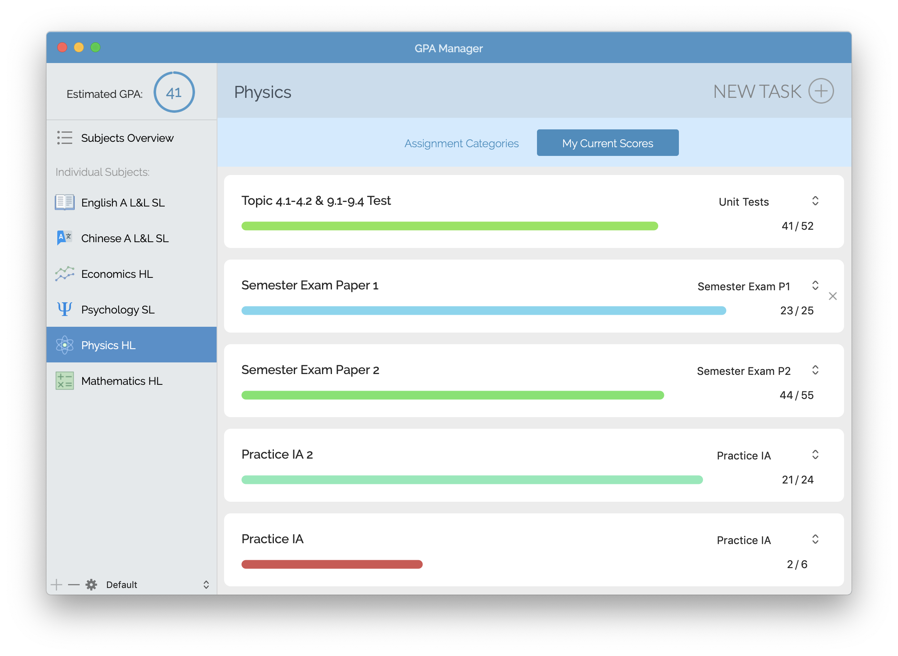
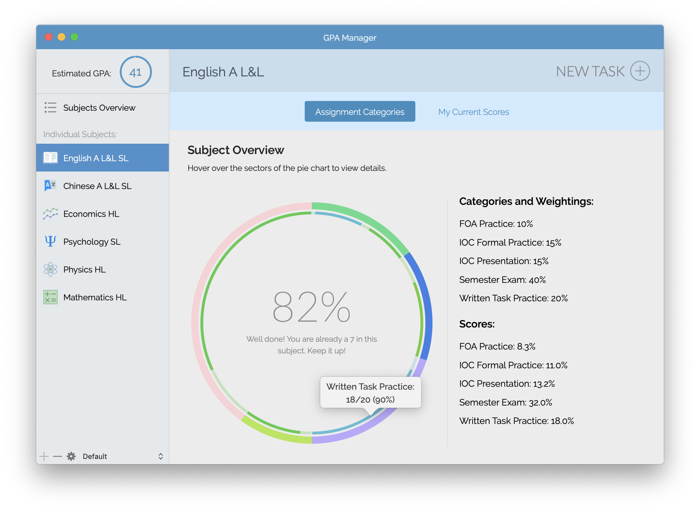

# GPA-Manager
This is an app I developed when I was in grade 12 for high school students under the IB system to manage their GPA, their assignment grades, etc. Emphasis is placed on GUI and user interaction.

Here are some screenshots of how this app looks like.

You can view all your subject grades:

You can add, remove, or change your scores for each assignment for every subject:

You can view the weightings for each score category and how you did from the interactive pie chart:

When this app was first released, I had a server with information about the current grade bins (because in the IB curriculum the boundaries change every year) that the app could connect to, but now the server's no longer maintained. However, you can manually adjust the boundaries by dragging the interactive view.

